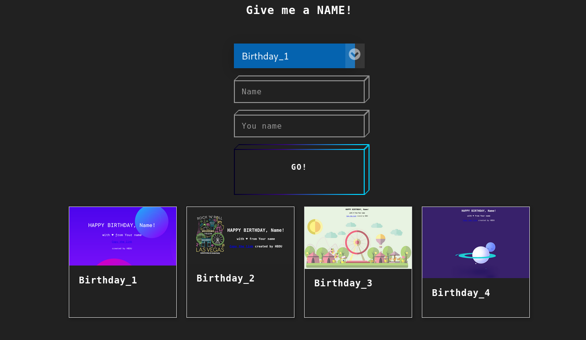

# HBDU
HBDU (Happy-BirthDay-U) is a website for your friends' birthday. Enter your friend's name then send the link!

[](https://github.com/ebsa491/HBDU/actions)
[](https://www.python.org/)
[](https://www.gnu.org/licenses/gpl-3.0)
[](https://github.com/ebsa491/HBDU/releases)

[](https://github.com/ebsa491)



## Table of contents
* [Requirements/Credit](#requirements)
* [Setup](#setup)
* [Run](#run)
* [Contributing](#contributing)
* [Bug Reporting](#bug-reporting)
* [TODO](#todo)
* [Other](#other)

## Requirements

For requirements see [requirements.txt](./requirements.txt)

Templates credit:

* [Home template](https://codepen.io/marko-zub/pen/mzPeOV)
* [Home selection-box](https://codepen.io/FrankieDoodie/pen/Pyrqyp)
* [Home grid](https://www.quackit.com/html/html_editors/scratchpad/?example=/css/grid/examples/cards_auto-fill_align-items_stretch)
* [Birthday_1 template](https://codepen.io/joyanna/pen/NWGYLNW)
* [Birthday_2 template](https://codepen.io/kaisle/pen/ZEGwpLb)
* [Birthday_3 template](https://codepen.io/gxash/pen/YqmxWg)
* [Birthday_4 template](https://codepen.io/jcoulterdesign/pen/BrdPaw)
* [404 template](https://codepen.io/genarocolusso/pen/XWbGMLp)

## Setup

```shell
(ROOT_PROJECT_DIR)$ pip3 install -r requirements.txt # You can use virtual env too.
```

## Run

just
```shell
(ROOT_PROJECT_DIR)$ ./run.sh
```

or
```shell
(ROOT_PROJECT_DIR)$ export FLASK_APP=src/HBDU/
(ROOT_PROJECT_DIR)$ export FLASK_ENV=production # or development for developing
(ROOT_PROJECT_DIR)$ flask run
```

or using `docker`
```shell
(ROOT_PROJECT_DIR)$ ./run_docker.sh # 127.0.0.1:PORT
```

## Contributing

I will be glad! Open an issue first or work on your assigned issue.

## Bug Reporting
If you have found any important bug or vulnerability,
open an issue or contact me please.

email: ebsa491@gmail.com
## TODO

See [TODO.md](./TODO.md)

## Other

Nothing more! Just pay attention to [`LICENSE`](./LICENSE) and enjoy my free software.
